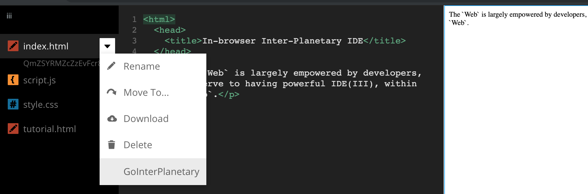

# III: In-browser Inter-Planetary IDE
> The `Web` is largely empowered by developers, who deserve to having powerful IDE(III), within the `Web`.

**Based on _Bramble_, which is based on _Brackets_**

> [III](https://github.com/snspace/brackets) <- [Bramble](https://github.com/mozilla/brackets) <- [Brackets](https://github.com/adobe/brackets)

_**Notice:**_

- The motivation of this project is the desire of a powerful web developer tool, right inside web, a distributed web.
- _Brackets and Bramble(Port of Brackets for Browser) portion_ can be used as it is, as a code editor for the web in browser.
- As a major new feature, _`Inter-Planetary` portion_ is @poc(Proof of Concept) now, which probably will be kept working on continuously.

### Forwarding

:doing: -> _Alpha: using-building-using cycles towards a fully functional IDE_

:done:
---
_[IBIPFS](https://github.com/snspace/ibipfs)_ for Inter-Planetary // Proof of Concept

`III/Bramble/Brackets`:
- Menu[IBIPFS]? or
- `src/main` <-> `filesystem/impls/ibipfs` <-> `src/iii/client/main.js` <-> `thirdparty/ibipfs`?
:eyes: `Brackets`: [FileSystemImpl](https://github.com/adobe/brackets/wiki/File-System-Implementations)
- `filesystem/FileSystem.js - require("fileSystemImpl")` <-> `src/main.js`
:eyes: `Bramble/Brackets`: `src/main` <-> `filesystem/impls/filer` <-> `src/bramble/client/main.js` <-> `thirdparty/filer`
:eyes: [filer: Node-like file system for browsers](https://github.com/filerjs/filer) // `.../providers/ibipfs.js`?
> `ibipfs`: "This place is based on the abstraction of database(indexedDB, memory, websql), is it fit for me???" // `ibipfs.object`(which is a _legacy_ API)?   
> `ibipfs`: `filer` looks like the `files`(MFS) perspective of mine. // Both are `indexedDB` behind the scene?
---
_Chore_: Fixes to setup for local development :eyes: _How to setup ..._
- * _add_ `version` to `src/package.json` // Otherwise, `npm-install-src` @grunt may fail.
- typo error in `src/extensions/bramble-extensions.json` (HtmlEntityCodeHints to HTMLEntityCodeHints)
- some commands/scripts changes in `package.json` and `Gruntfile.js`

### How to setup III(Bramble(Brackets)) in your local machine

Step 1: Make sure you fork and clone [III(Bramble(Brackets))](https://github.com/snspace/brackets).

```
$ git clone https://github.com/[yourforkpath]/brackets --recursive
```

Step 2: Install its dependencies

Navigate to the root of the directory you cloned and run:

```
$ npm install
```
:eyes: `npm install -g <devDependencies.pkg>` // Otherwise, the scripts(e.g, `npm run build`) may fail.
 
NOTE: if you are running on Windows, and experience a build error with the `iltorb` package,
consider adding the `--no-optional` flag to have npm skip installing `iltorb`, which is optional
and requires python, gyp and a working c++ build environment.
See comment in https://github.com/mozilla/brackets/pull/588#issuecomment-280438175

Step 3: Run III:

The easiest way to run III is to simply use:

```
$ npm start
```

This will generate the strings needed for localization in your `src/nls` folder and allow you to access Bramble on `localhost:8000` (NOTE: you need npm version 5 for the cleanup step to run properly; if it doesn't, use `npm run unlocalize` to restore the files in `src/nls/**/*`). It will also build the Bramble iframe API in `dist/` if necessary. You can terminate the server with `Ctrl+C` which will also clean up the strings that were generated in your `src/nls` folder. If any changes are made in the `src` directory, just refresh the page hosting Bramble in your browser to reflect those changes.

If you want to simply run the server without the localized strings, run:

```
$ npm run server
```

However, if you wish to run your own static server, there are several options available:
* [Apache Webserver](http://www.apache.org/)
* Host on [github pages](https://help.github.com/articles/what-are-github-pages)
* [Python WebServer](https://docs.python.org/2/library/simplehttpserver.html)

Assuming you have III running on port `8000`. Now you can visit [http://localhost:8000/src](http://localhost:8000/src)

**NOTE 1:** Bramble expects to be run in an iframe, which hosts its filesystem. For local
development, use `src/hosted.html` instead of `src/index.html`.  To see how the remote end
should host Bramble's iframe, see `src/hosted.js`.

**NOTE 2:** Using `npm run build` will overwrite contents in the `src/nls` folder. These changes are necessary if you access Bramble using [http://localhost:8000/src](http://localhost:8000/src). After using Bramble, you can undo the changes by running `npm run unlocalize`.

**NOTE 3:** To use Bramble in a production setting locally, you can run `npm run production` and access Bramble at [http://localhost:8000/dist](http://localhost:8000/dist) :eyes: _III: This didn't work at this time of trial!_

### Extension Loading

Bramble loads a set of extensions defined in `src/extensions/bramble-extensions.json`. You can
alter which extensions Bramble loads by adding or removing items from this list.  You can also
temporarily disable extensions by using `?disableExtensions`. For example: to disable QuickView
and CSSCodeHints, load Bramble with `?disableExtensions=QuickView,CSSCodeHints` on the URL.